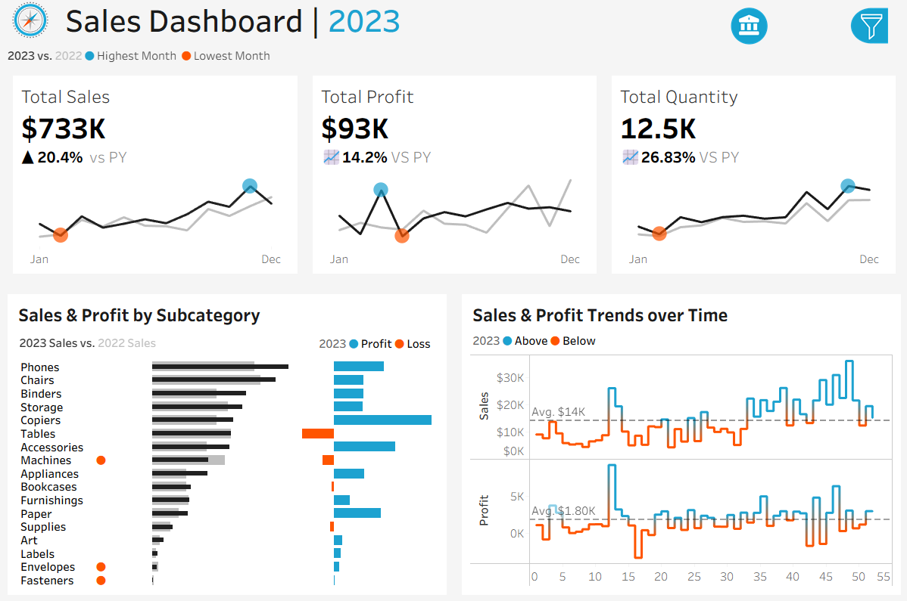
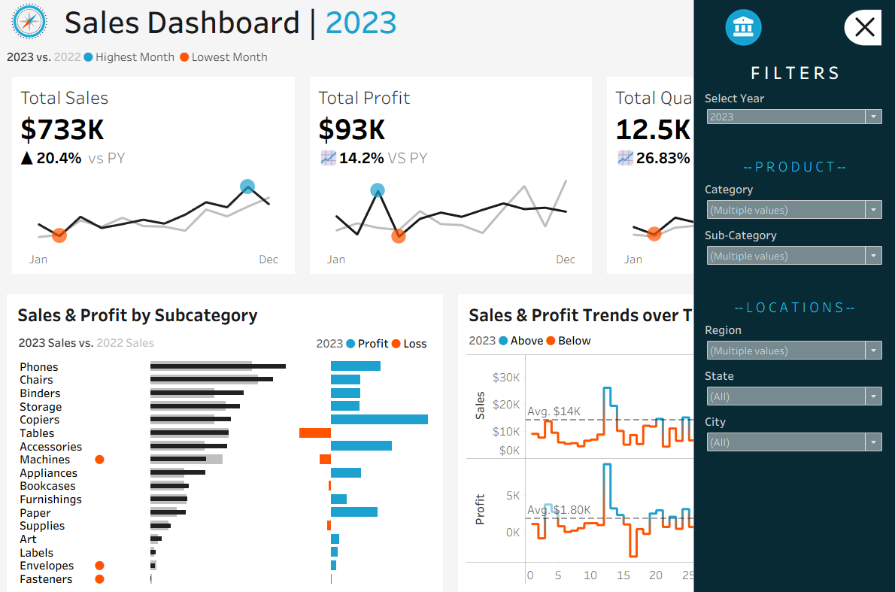

# 📊 Tableau Sales Performance Dashboard

## 🔹 Project Overview
This project presents an interactive Sales Performance Dashboard built using Tableau.

The dashboard enables dynamic year selection (2021–2023) and automatically compares the selected year’s performance with its immediate previous year.

All KPI metrics and visualizations update dynamically based on selected filters.

---

## 🔹 Dataset Used
The dashboard is built using the following structured datasets:

- Customers.csv
- Orders.csv
- Products.csv
- Location.csv

These datasets were joined and modeled to analyze sales performance across customers, products, and geographic locations.

---

## 🔹 Key Features
- Dynamic Year Selection (2021–2023)
- Automatic comparison with previous year
- Sales, Profit & Quantity KPI Cards
- Highest & Lowest Performing Month Indicators
- Sales & Profit Analysis by Sub-Category
- Profit vs Loss Visualization
- Sales & Profit Trend Analysis with Average Reference Line
- Region, State & City Filters
- Fully Interactive Dashboard

---

## 🔹 Dashboard Overview

---

## 🔹 Filters

---

## 🔹 Business Insights Enabled
- Identify top-performing and loss-making sub-categories
- Compare selected year performance against prior year
- Monitor monthly sales and profit trends
- Analyze regional, product, and customer-level contribution
- Evaluate category performance across different locations

---

## 🔹 Tools & Technologies
- Tableau
- Data Modeling & Joins
- Data Visualization
- Business Performance Analysis

---

## 🔹 How to Use
1. Download the `.twbx` file  
2. Open it in Tableau Desktop  
3. Select a year from the filter panel  
4. Explore performance metrics dynamically  

